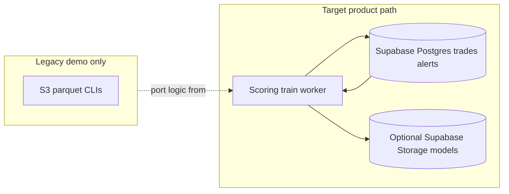

# Backend core: Supabase-first data plane, ML lifecycle, analyst experience

## Assumption (updated)

**Trades (and related dimensions) already land in Supabase Postgres**—via your app, Edge Functions, ETL, or another writer. The backend’s job is **not** to own a parallel lake as the primary path; it is to **score, alert, explain, and investigate** on top of the tables you already use, with **jobs and APIs** that stay fast and auditable.

Optional: **Supabase Storage** for large binaries (`isolation_forest.pkl`, `medians.json`, exported training snapshots). AWS S3 is not required for the product.

---

## Who uses this and what they expect

Same as before ([frontend-build-context.md](../frontend-build-context.md)): **analysts** triage and document; **leads** oversee outcomes and model transparency.

They expect a **real alert queue**, **rich context per trade**, **clear model lineage** (which run produced this alert), and **no mystery data source**—everything traceable to **rows in Supabase**.

---

## Current state (reframed)

- FastAPI CRUD already targets Postgres ([router](../trade_surveillance/api/router.py), [Trade](../trade_surveillance/models/trade.py), [Alert](../trade_surveillance/models/alert.py)).
- Existing [pipelines/](../trade_surveillance/pipelines/) and [agents/tools.py](../trade_surveillance/agents/tools.py) still assume **S3 parquet**—treat that as **reference math and feature definitions** to **reimplement against SQL extracts**, not as the live ingestion path.

**Design principle:** One operational truth: **Supabase**. Batch jobs **SELECT** windows of trades (and joins as needed), build a DataFrame in memory or incremental chunks, train or score, then **UPDATE/INSERT** alerts and `model_runs`.

---

## 1) Data contract on Supabase (no separate “ingestion product” unless you need it)

If writers already populate `trades`:

- Add only what scoring needs: e.g. **`ingested_at` / `updated_at`** on `trades` if not already present, and a **`scoring_jobs` cursor** or **`alerts.scoring_run_id`** FK to tie alerts to a [ModelRun](../trade_surveillance/models/model_run.py).
- For **point-in-time explainability**, consider **`alerts.model_features`** JSONB (frozen feature vector at score time) so UI and audits do not depend on later edits to the trade row.

If you still want a **bulk ingest API** for non-Supabase producers, it remains optional—same upsert pattern into `trades`.

---

## 2) Feature engineering: read from Postgres

- **Offline / batch retrain:** Scheduled job runs a **SQL query** over a date range (indexed on `symbol`, `trade_date`, `timestamp` per existing [Trade indexes](../trade_surveillance/models/trade.py)), builds features in pandas/Polars, fits IsolationForest, writes **artifacts to Storage** + **ModelRun** row in Postgres.
- **Online / incremental score:** Worker selects **trades newer than last watermark** (or not yet present in `alerts` for the active model version), joins whatever is needed for z-scores and ratios (same SQL patterns or precomputed **rollup tables** / materialized views for symbol×day stats if volume grows).

**Consistency:** One shared module (e.g. `trade_surveillance/ml/features.py`) defines column order and transforms; training and serving both call it.

**Legacy CLI:** Keep [feature_engineering.py](../trade_surveillance/pipelines/feature_engineering.py) for demos or one-off replays; product path does not depend on it.

---

## 3) Model training and artifacts

- **Where jobs run:** Same as before—not on the FastAPI request thread. Use **Supabase pg_cron** invoking a small Edge function + HTTP to your worker, **a dedicated worker VM/container**, or **GitHub Actions** hitting an internal “run job” endpoint with a secret.
- **Artifacts:** `model.pkl` + `medians.json` in **Supabase Storage** (private bucket), paths recorded in `model_runs.artifact_keys` (or a `system_config` table: `active_model_storage_path`).
- **Lifecycle:** `ModelRun` status transitions; **promotion** of active model via a Postgres flag or config row after sanity checks (flag rate, basic drift stats in `metrics` JSONB).

---

## 4) Alerts: scores → Supabase `alerts`

Unchanged intent: worker **upserts** [Alert](../trade_surveillance/models/alert.py) by `trade_id`, fills scores/SHAP/type, aligns **severity** with shared rules (same source as [orchestrator](../trade_surveillance/agents/orchestrator.py) regulatory logic).

---

## 5) Updating the model as new data lands in Supabase

1. **New rows** in `trades` (continuous).
2. **Scoring loop:** NOTIFY/LISTEN, **Supabase Realtime** subscription in worker, or **poll** `WHERE timestamp > :cursor` / `WHERE id > :cursor` with a stable ordering—choose based on ops simplicity.
3. **Retrain:** Nightly/weekly job reads a rolling window from Postgres, retrains, uploads new artifact, inserts `ModelRun`, optionally flips active version.
4. **Drift:** Aggregate queries in Postgres feed `model_runs.metrics` and later [overview metrics](../trade_surveillance/api/routes/metrics.py).

No requirement for **dual-write to object storage** for trades; backups/export can be a separate concern.

---

## 6) API and services

- **`api`:** CRUD, Supabase JWT auth, read-optimized composite endpoints, enqueue internal jobs.
- **`worker`:** Score, train, optional long `investigate_trade` / memo generation.

Endpoints (unchanged intent): alert **queue** view, **surveillance-context** for a trade, **async investigate** backed by **Postgres-only** hydration for the LangGraph path.

**Observability:** `trade_id`, `model_run_id`, correlation id on mutations.

---

## 7) Schema / mapping

Your [Trade](../trade_surveillance/models/trade.py) model is already rich—ensure **feature code uses the same column names and nullability** as the live table. If legacy pipeline used different names, keep a **thin mapper** from “pipeline column” → “DB column” inside the new `ml` module only.

---

## 8) Implementation order (phased)

1. **DB contract** — watermarks, optional `model_features` on alerts, indexes verified for window queries.
2. **ML from Postgres** — extract features + score from SQL-sourced frames; persist artifacts to Storage; wire `ModelRun`.
3. **Scoring worker** — new trades → alerts (idempotent).
4. **`investigate_trade`** — read trader/symbol context from Postgres; memos to Storage or JSON on investigation if you add that column.
5. **Read APIs + metrics** tied to real runs.
6. **Scheduling** — pg_cron / worker / external cron.

---

## Risk notes (updated)

- **Volume:** Very large tenants may need **rolled-up aggregates** or occasional **Parquet export** from Supabase for train-only—not the default assumption.
- **Rank / z-scores:** Still window-dependent; store **`scoring_mode`** or **`feature_spec_version`** on the alert.
- **SHAP cost:** Batch or sampled SHAP for training window; online path may be score-only with SHAP on demand for flagged rows.
