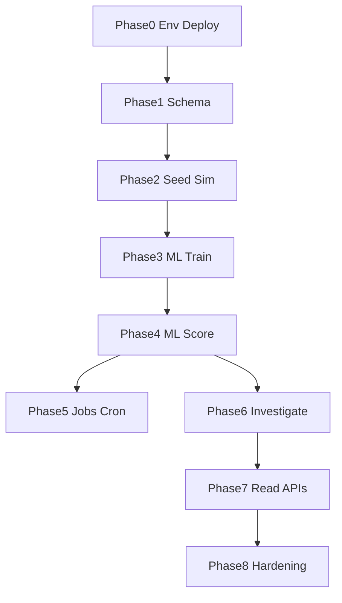
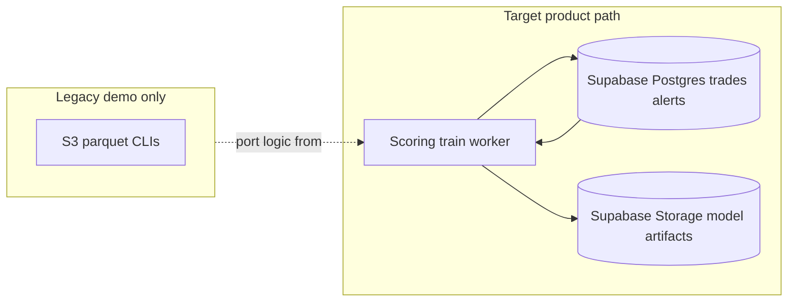

# Backend core: Supabase-first data plane, ML lifecycle, analyst experience

## Execution status (living)

| Status | Items |
|--------|--------|
| **Done** | **Phase 0** — `Dockerfile`, `.dockerignore`, `render.yaml`, `.env.example` (Supabase Storage vars), README deploy (Render + Vercel). **Phase 1** — `system_config` table + model columns on `alerts` + idempotent [`migrator.py`](../trade_surveillance/db/migrator.py); ORM + alert schemas/CRUD + web types for new alert fields. **Phase 2** — one-time bulk seed [`mock_data_script.py`](../mock_data_script.py); live batch CLI [`live_simulate.py`](../live_simulate.py) (`gen_trade(timestamp_override=…)`); README demo section; removed duplicate `trade_surveillance/scripts/` seed. |
| **Deferred (cost / scope)** | **Render paid Cron** for `live_simulate.py` — skipped to avoid billing; run simulator **manually**, **`--interval-sec`** locally during demos, or add **GitHub Actions** (`workflow_dispatch` or sparse `schedule`) later. **Render second worker** for `score-batch` — same until needed; run worker from laptop against prod `DATABASE_URL` if ever required. |
| **Backlog** | **Phase A** — `audit_events` + timeline API (only if product wants immutable audit UI). **Parallel frontend** — F.1–F.4 in plan (queue endpoint, context, investigate button, model run panel). **GBM continuity across Cron processes** — `mock_data_script._price_state` resets each process; optional persist/rehydrate later. |
| **Next up** | **Phase 3** — `trade_surveillance/ml` train from Postgres → Supabase Storage + `model_runs` + `system_config` pointers. **Phase 4** — scoring worker / watermark → upsert `alerts`. Then **Phase 5** (minimal internal `POST` job hooks, no paid scheduler), **Phase 6–8** as ordered in sections below. |

---

## Assumption (updated)

**Trades (and related dimensions) already land in Supabase Postgres**—via your app, Edge Functions, ETL, or another writer. The backend’s job is **not** to own a parallel lake as the primary path; it is to **score, alert, explain, and investigate** on top of the tables you already use, with **jobs and APIs** that stay fast.

**Model artifacts:** **Supabase Storage** (private bucket) — confirmed. Versioned keys; `model_runs.artifact_keys` + optional `system_config.active_model_*`. AWS S3 is not required for the product.

---

## Stakeholder decisions (captured Q&A)

| Topic | Decision |
|--------|-----------|
| Tenancy | **Single organization** for MVP — no multi-tenant row tagging required. |
| Model artifacts | **Supabase Storage** for `pkl` / `medians.json` (and similar). |
| Showcase shape | **Thin vertical slice across all pillars**: alert queue, scoring path, AI investigation, model ops — each visible in the demo, not one deep silo. |
| Demo data | **Bulk historical seed** plus a **live simulator** that keeps inserting new trades on a cadence. |
| LLM | **Real Anthropic** for compliance memo / LangGraph path (`ANTHROPIC_API_KEY`); plan for latency, failures, and cost caps in demo. |
| Retrain | **Manual** internal/admin trigger **and** **scheduled** retrain once scheduling exists. |
| Audit trail (`audit_events`) | **Out of scope for MVP** — not implemented unless a **UI feature** (e.g. compliance timeline) needs it. **Mutable rows + investigation_notes** remain the accountability surface for the showcase. |
| Feature scope (v1) | **5–8 hand-picked** features derived from `Trade` / SQL; version string on each score; grow toward legacy 12-feature parity later. |
| Hosting | **Backend on Render**; **frontend on Vercel** (`NEXT_PUBLIC_API_BASE_URL` → Render API URL). |
| Internal / admin API protection | **None for MVP** (no secret header); treat as demo-only risk — **must** add auth before any real deployment. |
| Supabase RLS | **Out of scope** for this project; single trusted API/database role is acceptable. |
| Environments | **Single Supabase project / one `DATABASE_URL`** for **local** and **hosted demo** (same schema; optional different seed datasets). |
| Memos & media | **Hybrid:** keep **query-friendly** fields in Postgres (summary, verdict, key structured bits, Storage **path** when applicable); put **large blobs** (full memo JSON, exports, future media) in **Supabase Storage**. |
| **Locked defaults (Q&A)** | **Seed ~100–200k trades** via `mock_data_script.py`. **Live:** `live_simulate.py` ~50–100 rows per **1–5 minutes** (cadence **manual / local loop** for now — **Render Cron deferred** to avoid paid add-on). **Scoring:** target **≤ ~5 minutes** lag once a worker runs on a schedule (**Render Cron or GitHub Actions — not wired yet**). **Write path:** bulk/live CLIs + optional **`POST /trades`**; scoring uses **timestamp watermark** only. |

### Glossary (what “volume / write path / scoring SLA” meant in the plan)

These are **planning dimensions**, not your trade table’s `volume` column:

| Term | Meaning |
|------|--------|
| **Trade throughput (“volume”)** | How many **new trade rows per unit time** (e.g. per day) the system should handle. Informs batch sizes, indexes, and whether you need rollups — **separate** from the numeric **volume** field on each trade. |
| **Write path** | **Which software inserts or updates** rows in `trades` (FastAPI, seed script, simulator CLI, Supabase Edge, manual SQL, etc.). The scoring worker only needs a **watermark** (cursor on `timestamp` or id), not knowledge of the writer. |
| **Scoring SLA / latency** | **Target delay** from “trade row committed” to “alert row updated if flagged” (e.g. sub-minute vs 5-minute micro-batch vs nightly). |

**Showcase defaults** are superseded by the **Locked defaults** row in the stakeholder table above.

### Deployment & worker layout (Render + Vercel)

- **Vercel:** hosts the Next.js app; configure CORS on Render to allow the Vercel origin (`ALLOWED_ORIGINS`).
- **Render:** hosts FastAPI. For **scoring / retrain / simulator** workloads, prefer **not** blocking the web worker indefinitely: when scheduling is adopted, use a **Render Background Worker** or **Cron Job** (or **GitHub Actions** at no extra platform cost) with a different **start command** (e.g. `python -m trade_surveillance.worker score-batch`), *or* a scheduled HTTP hit to an internal route — still **without** secret-header auth for MVP, so keep such routes **undocumented / path-obscurity only** and plan to lock down later. **As of Phase 0–2:** only the **web** service is required; Cron/worker is **backlog** (see Execution status).
- **Secrets:** `DATABASE_URL`, `ANTHROPIC_API_KEY`, Supabase Storage credentials (if not derived from Supabase service key) live in **Render** and **local `.env`** only — never in the repo.

---

## Codebase inventory (starting point)

**ORM tables today:** `users`, `instruments`, `traders`, `clients`, `counterparties`, `trades`, `alerts`, `investigations`, `investigation_notes`, `model_runs` (see [`trade_surveillance/models/`](../trade_surveillance/models/)).

**Investigation memo fields already exist:** [`Investigation.memo_json`](../trade_surveillance/models/investigation.py), [`Investigation.memo_storage_key`](../trade_surveillance/models/investigation.py) — use **JSONB for structured memo + list UI**; set **`memo_storage_key`** when uploading a **full blob** to Storage.

**FastAPI routers:** [`trade_surveillance/api/router.py`](../trade_surveillance/api/router.py) mounts `health`, `trades`, `alerts`, `investigations`, `investigation-notes`, `model-runs`, `users`, `metrics`.

**Migrations:** imperative steps in [`trade_surveillance/db/migrator.py`](../trade_surveillance/db/migrator.py) `run_migrations()` after `create_tables()` — **no Alembic** today; new columns/tables go here + matching SQLAlchemy models.

**Legacy ML (reference only):** [`trade_surveillance/pipelines/feature_engineering.py`](../trade_surveillance/pipelines/feature_engineering.py), [`trade_surveillance/pipelines/anomaly_model.py`](../trade_surveillance/pipelines/anomaly_model.py), [`trade_surveillance/agents/tools.py`](../trade_surveillance/agents/tools.py) (S3 parquet).

---

## Detailed phased execution plan

Phases are **sequential dependencies** unless noted. Each phase lists **objective**, **concrete tasks**, **primary files**, and **exit criteria**.

**Optional later:** **Phase A — Audit timeline** (only if the Next.js app adds a timeline): `audit_events` table, emit helper, `GET /audit-events`, wire CRUD + worker lifecycle.

---

### Phase 0 — Environment, deployment, and runbook

*Status: **COMPLETE** — deploy artifacts + README; optional second Render service not provisioned.*

**Objective:** Anyone can run API + worker against **one** Supabase DB locally and on Render; Vercel can call the API without CORS failures.

| # | Task | Detail |
|---|------|--------|
| 0.1 | Document env vars | Extend [`.env.example`](../.env.example): `DATABASE_URL`, `ALLOWED_ORIGINS` (include Vercel preview + prod URLs), `ANTHROPIC_API_KEY`, Supabase **service role** or Storage keys if using `supabase-py` / signed uploads (`SUPABASE_URL`, `SUPABASE_SERVICE_ROLE_KEY`, bucket name constants). |
| 0.2 | Render web service | Dockerfile or native Python build; `uvicorn` command; health check on `GET /health`. |
| 0.3 | Render worker/cron | Second service or Cron hitting internal job URLs **or** separate process `python -m trade_surveillance.worker …` (introduced in Phase 4–5). Same image, different start command. |
| 0.4 | Vercel | Set `NEXT_PUBLIC_API_BASE_URL` to Render URL; confirm the Next.js `apiFetch` client (separate `trade-surveillance-web` repo) works cross-origin. |
| 0.5 | README “Deploy” | Short section: Supabase project, env copy-paste, first migrate, seed (after Phase 2). |

**Exit criteria:** Local `DATABASE_URL` run succeeds; Render deploy green; browser from Vercel origin loads overview without CORS errors.

---

### Phase 1 — Database schema extensions

*Status: **COMPLETE** — `system_config`, alert ML columns, migrator + CRUD/schemas + web adapters.*

**Objective:** Persist **ML lineage**, **watermarks**, and **optional frozen features** without breaking existing CRUD. **No `audit_events` table** unless Phase A is approved.

| # | Task | Detail |
|---|------|--------|
| 1.1 | `system_config` (or `job_state`) | Key-value or typed rows: e.g. `scoring_watermark_timestamp`, `active_model_run_id`, `active_feature_spec_version`. Alternative: single-row `app_state` JSONB — pick one pattern and document. |
| 1.2 | `alerts` extensions | Add nullable: `feature_spec_version` (text), `model_features` JSONB (frozen vector + metadata), `scoring_model_run_id` FK → `model_runs.id`, `scored_at` timestamptz, `scoring_mode` (text, e.g. `batch_v1`). Use `run_migrations()` for additive columns. |
| 1.3 | `trades` extensions (optional) | `ingested_at` timestamptz default now if you need distinction from `timestamp`; else document using existing columns only. |
| 1.4 | Wire `create_tables` | Register new models in [`trade_surveillance/models/__init__.py`](../trade_surveillance/models/__init__.py) `create_tables` import list. |

**Primary files:** optional `system_config.py`, edits to [`alert.py`](../trade_surveillance/models/alert.py), [`migrator.py`](../trade_surveillance/db/migrator.py).

**Exit criteria:** Fresh `create_tables_and_migrate()` against empty DB creates new columns; existing API tests still pass (prefer **nullable** adds).

---

### Phase 2 — Demo data: bulk seed + live simulator

*Status: **COMPLETE** — `mock_data_script.py` + `live_simulate.py`; no Render Cron.*

**Objective:** Reproducible **large** history + **steady trickle** of new trades for the showcase.

| # | Task | Detail |
|---|------|--------|
| 2.1 | Seed order | Insert FK parents first: `instruments`, `traders`, `clients`, `counterparties` (if used), then **bulk `trades`** with varied `symbol`, `volume`, `price`, `is_off_hours`, `is_otc`, `relative_spread`, `bid_size`/`ask_size` where applicable. |
| 2.2 | Bulk seed | One-time: [`mock_data_script.py`](../mock_data_script.py) with `OUTPUT_TARGET=database` (env `NUM_TRADES`, `DB_BATCH_SIZE`). |
| 2.3 | Live simulator | [`live_simulate.py`](../live_simulate.py) — reuses `gen_trade`; default ~**75** trades per tick; **`--interval-sec`** loop for local/demo. **Render Cron** for the same cadence → **deferred** (see Execution status). |
| 2.4 | README | “Repro demo”: seed command, optional simulator, expected row counts, reminder to run **train** (Phase 3) then **score** (Phase 4). |

**Exit criteria:** After seed, `SELECT count(*) FROM trades` matches target; simulator adds rows visible on next worker poll.

---

### Phase 3 — ML package: training from Postgres → Storage → `model_runs`

*Status: **NOT STARTED**.*

**Objective:** First **IsolationForest** trained **only** from Supabase data; artifacts in **Storage**; run recorded in **`model_runs`**.

| # | Task | Detail |
|---|------|--------|
| 3.1 | Package layout | New `trade_surveillance/ml/` with `feature_spec.py` (name + version constant `surv-fe-v1`, ordered column list 5–8), `dataset.py` (`read_training_frame(conn, date_from, date_to) -> DataFrame`), `train.py` (fit, `contamination` tunable via env or CLI flag). |
| 3.2 | Features | Implement v1 vector from [Trade](../trade_surveillance/models/trade.py) columns (log volume, price, spread fields, bools as 0/1, optional imbalance). Median impute from training frame; persist **medians dict** next to model. |
| 3.3 | Storage upload | Upload `model.pkl` + `medians.json` to paths like `models/{model_run_id}/model.pkl` using Supabase Storage API; set `model_runs.artifact_keys` JSON. |
| 3.4 | `ModelRun` row | Create row `run_type=TRAIN`, `status=STARTED` → work → `COMPLETED` or `FAILED`, `metrics` JSON (row count, contamination, flagged count on training sample if you score in-sample), `runtime_seconds`. |
| 3.5 | Promotion | On success, update `system_config` **active** model pointers to this `model_run_id`. |
| 3.6 | CLI | `python -m trade_surveillance.ml.cli train --since-days 365` (or full table for demo). |

**Exit criteria:** One completed `ModelRun`; objects visible in Storage bucket; `system_config` points to active artifacts.

---

### Phase 4 — ML package: scoring worker (micro-batch)

*Status: **NOT STARTED** (depends on Phase 3).*

**Objective:** New trades get **idempotent** `alerts` rows with scores, **optional SHAP** for flagged subset, **`feature_spec_version`** set.

| # | Task | Detail |
|---|------|--------|
| 4.1 | Load active model | Read `system_config` → download `pkl` + `medians.json` from Storage into memory/temp. |
| 4.2 | Watermark query | `SELECT * FROM trades WHERE timestamp > :watermark ORDER BY timestamp LIMIT :batch` (or use PK cursor). Advance watermark only after successful commit. |
| 4.3 | Score + upsert alerts | For each trade: build feature row → `decision_function` / predict → if anomaly, **INSERT … ON CONFLICT (trade_id) DO UPDATE** on `alerts` (unique on `trade_id` exists). Set `scoring_model_run_id` to a dedicated **score** `ModelRun` (recommended: new `ModelRun` per score-batch with `run_type=SCORE_BATCH`). |
| 4.4 | SHAP | For flagged rows only, TreeExplainer on small batch; cap `MAX_SHAP_ROWS` per tick; store in `top_3_shap_features` / `top_shap_feature`; set `anomaly_type` via shared rule helper in `trade_surveillance/ml/rules.py` (port from [`anomaly_model.py`](../trade_surveillance/pipelines/anomaly_model.py) / [`orchestrator.py`](../trade_surveillance/agents/orchestrator.py)). |
| 4.5 | Severity | Map rules to `alerts.severity` string consistent with UI adapters. |
| 4.6 | Worker entrypoint | `python -m trade_surveillance.worker score-batch` exiting 0 on success (for Cron). |

**Exit criteria:** After one worker run, new trades have corresponding `alerts` when flagged; rerunning worker does **not** duplicate alerts.

---

### Phase 5 — Job scheduling and internal triggers

*Status: **NOT STARTED** — **5.2 Render Cron** and second worker **deferred** (cost); **5.1** + manual CLI / optional **GitHub Actions** are the near-term path.*

**Objective:** **Manual** kick + **scheduled** automation (Render Cron **or** GitHub Actions **or** laptop cron); **no** long jobs on default FastAPI worker thread.

| # | Task | Detail |
|---|------|--------|
| 5.1 | Internal routes (minimal) | e.g. `POST /api/v1/internal/jobs/train`, `POST /api/v1/internal/jobs/score` — for **quick** smoke only; document that production-like loads should call **worker CLI** (not inline in web process). |
| 5.2 | Scheduled jobs | **Backlog / deferred:** Render Cron for `score-batch` ~**5 min** + optional nightly `train`. **Alternative:** `workflow_dispatch` or sparse `schedule` in GitHub Actions hitting internal route or running container job. |
| 5.3 | Idempotency | Advance watermark only after successful batch commit (or equivalent). |

**Exit criteria:** At least one **manual** train + score path documented; when scheduling is enabled, logs show recurring runs and DB watermarks advance. *(Full “Cron visible in Render” criterion waits on 5.2 or GH Actions.)*

---

### Phase 6 — Investigation: Postgres-backed LangGraph + API

*Status: **NOT STARTED**.*

**Objective:** `investigate_trade` uses **DB** for trade, trader history, market window; persists [`Investigation`](../trade_surveillance/models/investigation.py); **Anthropic** live; optional **Storage** for oversized memo.

| # | Task | Detail |
|---|------|--------|
| 6.1 | Refactor data loaders | Replace or branch S3 reads in [`agents/tools.py`](../trade_surveillance/agents/tools.py) with SQLAlchemy queries (session passed in or created from `DATABASE_URL`). |
| 6.2 | Orchestrator | [`orchestrator.py`](../trade_surveillance/agents/orchestrator.py): accept `trade_id` + DB session; load anomaly row from **alerts** + **trades** join; build market window from `trades` filtered by `symbol` and time range. |
| 6.3 | Memo persistence | Map Claude JSON to `Investigation` fields; if payload large, upload full JSON file to Storage and set `memo_storage_key`; set `memo_json` for UI list fields (or truncate with note). |
| 6.4 | API | e.g. `POST /api/v1/trades/{trade_id}/investigate` or `POST /api/v1/alerts/{alert_id}/investigate` creating `investigations` row through completion. |
| 6.5 | Errors | Timeouts → failed investigation row + user-visible error JSON. |

**Exit criteria:** One investigation row per run with real Anthropic output in dev; frontend can GET investigation by id (extend existing routes if needed).

---

### Phase 7 — Analyst-facing read APIs and metrics

*Status: **NOT STARTED**.*

**Objective:** Fewer round-trips for the Next.js app; queue semantics for triage.

| # | Task | Detail |
|---|------|--------|
| 7.1 | Alert queue | `GET /api/v1/alerts/queue?status=OPEN&severity=HIGH&sort=created_at&order=desc&limit=` with stable sort; optional `assigned_to`. |
| 7.2 | Surveillance context | `GET /api/v1/trades/{trade_id}/surveillance-context`: trade row, alert if any, latest investigation summary, simple SQL aggregates for trader/symbol. |
| 7.3 | Metrics | Extend [`metrics/crud`](../trade_surveillance/crud/metrics.py) or schemas for **last successful train**, open alert counts by severity, etc., as needed for overview. |

**Exit criteria:** Vercel overview / alerts pages can use these endpoints without N+1 fan-out (optional incremental adoption).

---

### Phase 8 — Hardening, limits, and demo polish

*Status: **NOT STARTED**.*

**Objective:** Safe enough for a **public demo** narrative without production claims.

| # | Task | Detail |
|---|------|--------|
| 8.1 | Rate limits | Cap simulator default batch size; cap Anthropic calls per hour in env. |
| 8.2 | E2E checklist | Script or manual doc: seed → train → score → open alert → investigate; **no audit_events requirement**. |
| 8.3 | “Production next” appendix | RLS, internal job auth, separate DB per env, remove internal routes from public DNS; **optional Phase A audit** if compliance UI ships. |

**Exit criteria:** Checklist passes on clean DB; README tells the story end-to-end.

---

### Parallel track: Frontend (Vercel) — scope for web repo

Not blocking backend phases, but **depends on Phase 7** for best UX.

| # | Task |
|---|------|
| F.1 | Point alerts list to `GET .../alerts/queue` (or enhance existing list query params server-side). |
| F.2 | Trade / alert detail page: call `surveillance-context`. |
| F.3 | “Run investigation” button → `POST .../investigate`; loading + error states for Anthropic latency. |
| F.4 | Model runs panel: surface `model_runs.metrics` and timestamps from real data. |

---

## Architecture reference (concise)

**Data contract:** Watermarks in `system_config`; **`alerts.model_features`** + **`feature_spec_version`** for explainability; **`scoring_model_run_id`** for lineage.

**Feature engineering:** Read from Postgres in **`trade_surveillance/ml`**, not S3, for product path.

**Alerts:** Upsert by `trade_id`; severity/rules shared with ML **`rules.py`**.

**Legacy CLI:** Keep under `pipelines/` for reference; do not wire to Render product path.

---

## MVP feature vector (5–8 features, versioned)

Implement **`feature_spec_version`** (e.g. `surv-fe-v1`) stored on each alert (or inside frozen `model_features` metadata).

**Candidate starter set** (finalize after quick EDA on seeded data — drop columns with too many nulls):

- Normalized or log-scaled **volume**
- **Price** (and/or return vs a simple per-symbol window statistic if SQL window is cheap enough in v1)
- **Spread** or `relative_spread` when populated
- **`is_off_hours`**, **`is_otc`** as 0/1 inputs
- If stable: **bid/ask imbalance** from `bid_size` / `ask_size` when both present

**Training:** IsolationForest on seeded history; tune **`contamination`** (and optional score threshold) so open alerts are **credible** for the story (not empty, not “everything flagged”).

**SHAP:** For v1, compute for **flagged** rows in the scoring/train job; persist in existing alert JSON fields where possible.

---

## Who uses this and what they expect

Same as before ([frontend-build-context.md](../frontend-build-context.md)): **analysts** triage and document; **leads** oversee outcomes and model transparency.

They expect a **real alert queue**, **rich context per trade**, **clear model lineage** (which run produced this alert), and **no mystery data source**—everything traceable to **rows in Supabase**.

---

## Target architecture (mermaid)

**Design principle:** One operational truth: **Supabase**. Batch jobs **SELECT** windows of trades, train/score in Python, **UPDATE/INSERT** alerts and `model_runs`, upload blobs to **Storage**.

---

## Risk notes

- **Volume (throughput):** If demo grows very large, add rollups or export for train-only.
- **Rank / z-scores:** Window-dependent; store **`scoring_mode`** and **`feature_spec_version`** on the alert.
- **SHAP cost:** Cap rows per tick in worker.
- **Anthropic:** Timeouts, rate limits, token cost — surface errors to UI; optional caps.
- **Internal HTTP routes:** Demo-only exposure — document security debt explicitly.
